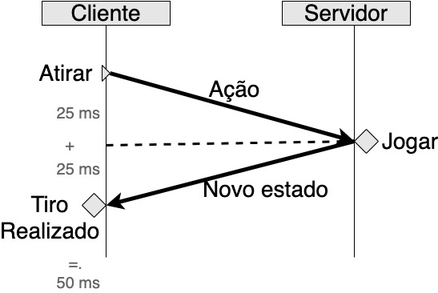

# O problema e sua arquitetura básica.

Neste capítulo vamos entender quais os problemas que serviços para games enfrentam e quais são algumas das formas de resolvê-los para obtermos um conjunto de serviços que tornam o desenvolvimento de jogos multiplayer uma realidade. 

> *Multiplayer*
> 
> Jogos multiplayer são jogos com mais de uma pessoa jogando simultaneamente se conectando através de um servidor.

## Introdução

Desenvolver um jogo é bastante complicado, agora desenvolver um jogo para mais de uma pessoa jogando é ainda mais complicado. Felizmente, podemos resumir os problemas que servidores de jogos possuem em duas categorias:

1. Humanos maliciosos.
2. Física realística.

### Humanos Maliciosos

Tudo começa com o desejo das pessoas de trapacear em um jogo.

Podemos dizer que para jogos single-player, ou de somente uma pessoa jogando, trapacear afeta a experiência, mas é uma escolha da pessoa burlar a experiência do jogo, a final a trapaça não afeta ninguém além da pessoa, porém para jogos multiplayer o cenário é diferente. Em um jogo multiplayer, uma pessoa burlando as regras do jogo pode conseguir algumas vantagens que além de afetar sua experiência, tornam a experiência das outras pessoas muito pior. Alguns exemplos que já vi na minha vida:

* Vida muito maior que 100%, ou seja, a pessoa possuia 1000% de vida em uma partida, tornando ela quase imortal, já que colecionava muito mais recursos.
* Tiros duplos ou triplos, ou seja, para cada vez que a pessoa realizava um tiro, duas ou três balas eram enviadas ao mesmo tempo, reduzindo muito as chances do alvo de sobreviver.
* Atravessar paredes, não sei bem como este mod funcionava, mas acredito que projetava a pessoa para além do objeto de colisão.
* Paredes invisíveis, ou seja, a pessoa havia removido a renderização de objetos inanimados, o que a permitia visualizar todos os alvos antes de ser percebida.
* Velocidade 2, ou seja, para cada passo da pessoa, o jogo a movia 2 vezes mais rápido.

Tendo estes eventos em mente, podemos concluir que existe uma única solução realmente confiável para um servidor NÃO CONFIAR NO USUÁRIO.

## Como não confiar no usuário?

A resposta para está pergunta é na verdade bastante simples, o cliente, ou seja a pessoa jogando, deve fornecer o mínimo de informações em relação ao seu posicionamento, balas disparadas, direção, etc. Enquanto isso, o servidor deve ser autoritário, recendendo estes comandos básicos e informado para o cliente o que está acontecendo. Em outras palavras, o cliente envia comandos e botões pressionados para o servidor, o servidor executa o próximo passo do jogo e devolve ao cliente as novas informações. Isso não vai impedir que o servidor seja explorado de vulnerabilidades, mas reduzirá drasticamente a capacidade de uma pessoa jogando de trapacear. Assim, para o caso da pessoa que está dando tiros múltiplos, ela pode até ver 3 tiros saindo de sua arma, mas o servidor reconhecerá somente 1 e propagará ao resto do jogo somente 1. 

Resumindo, o gerenciamento do estado do jogo é realizado apenas pelo servidor. Clientes enviam apenas suas interações com o controle, teclado e mouse para o servidor. O servidor atualiza o estado do jogo e envia esta informação de volta aos clientes que apenas renderizam ela em sua tela.

## O problema com a física

Parece uma solução perfeita né? Infelizmente ela funciona bem somente quando o jogo é baseado em turnos, como jogos de carta e alguns RPGs, ou a rede é em LAN, já que neste cenário a comunicação com o servidor é considerada instantânea. Para jogos como Call of Duty e Rainbow Six está estratégia vai contar com um enorme delay já que precisam se conectar com servidores distantes.

Assim, vamos supor o meu cenário. Mesmo que minha conexão à internet seja sensacional (mentira, isso não existe), estou em Porto Alegre e o servidor mais próximo está em São Paulo para o jogo X. Porto Alegre e São Paulo estão distantes entre si mais de 1100 km. Na física a velocidade da luz é a maior velocidade atingível por um corpo (photons no caso), ou seja 300.000 km/s no vácuo, assim a luz levaria 3,7 milisegundos para percorrer os 1100 km (1100/300000 = 0,0036667 segundos). Essa é a velocidade da luz no vácuo, parece bem otimista né? Mas neste caso estamos falando de bytes trafegando pela internet, que na prática são elétrons e pulsos de luz trafegando por um cabo, e provavelmente não em linha reta, o que deve aumentar esse valor de 3,7 por alguns microsegundos. Existe mais um fator importante em como a internet funciona, os dados trafegados pela internet são na verdade uma séries de pacotes, ou *hops*, que trafegam de um roteador ao outro, certamente abaixo da velocidade da luz. Além disso, roteadores possuem um atraso extra, já que todos os pacotes devem ser abertos, copiados e inspecionados para então serem reroteados a seus destinos finais.

Vamos então dizer que o atraso dos meus pacotes até São Paulo leva 25 ms, o que seria um tempo excepcional (neste momento um ping da minha máquina ao google.com está levando entre 25 e 30 ms), mas tempos de 50 ms e até 200 ms não seria impressionantes para certas situações. Agora vamos dizer que nossa jogadora apertou para atirar no momento x, isso quer dizer que nosso servidor receberá a ação de atirar 25 ms depois. Digamos que nosso servidor processe o evento em um tempo substancialmente menor que 1 milisegundo, algo como 500 us, isso quer dizer que quando o servidor responder, a jogadora receberá essa atualização 50 ms depois de ter clicado para atirar. Humanos em média enxergam 25 frames por segundo, o que indica que o delay já é maior que nossa capacidade de observação por 10 ms. Esses 10 ms de delay na nossa percepção já são suficiente para termos uma experiência ruim de jogabilidade, ou seja, o famoso *lag*, ou atraso. A imagem a seguir demonstra este efeito:

