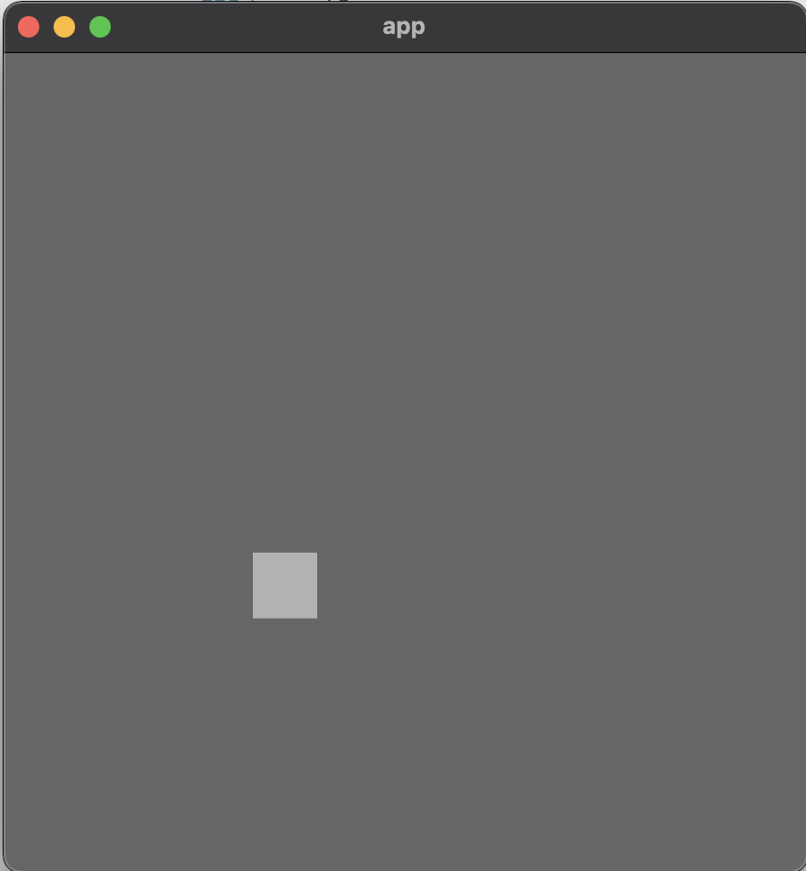

# Grade de Movimento

Nosso sistema de movimentação tem utilizado coordenadas da janela para fazer a movimentação, sendo o ponto `(0,0)` o centro da janela e cada unidade corresponde a um pixel, porém o snake game utiliza um sistema de grade. Assim, precisamos definir uma grade básica com tamanho da grade de `10 x 10` e células da grade com mais de 1 pixel para evitar janelas de 10 px por 10 px. Além disso, definir uma grade a aprtir do centro é bastante complexo, por isso vamos utilizar nosso próprio sistema de coordenadas e criar um sistema que faça a conversão. Nosso primeiro passo é adicionar constantes referentes ao tamnho da arena. É importante que estas constantes sejam definidas fora, pois quando iniciarmos o modo multiplayer `10 x 10` será muito pequena. 

```rs
// main.rs
mod snake;

const GRID_WIDTH: u32 = 10;
const GRID_HEIGHT: u32 = 10;

fn main() {
    // ...
}
```

As constantes `GRID_WIDTH` e `GRID_HEIGHT` referemm a largura da arena e a altura da arena, respectivamente. Agora criamos um novo módulo `components` que é responsável por gerenciar componentes básicos e transversair do jogo, como posição (`Position`) e tamanho de célula (`Size`):

```rs
// main.rs
mod snake;
pub mod components;

const GRID_WIDTH: u32 = 10;
const GRID_HEIGHT: u32 = 10;
// ...

// components.rs
use bevy::prelude::Component;

#[derive(Component, Clone, Copy, PartialEq, Eq)]
pub struct Position {
    pub x: i32,
    pub y: i32,
}

#[derive(Component, Debug, PartialEq)]
pub struct Size {
    pub width: f32,
    pub height: f32,
}

impl Size {
    pub fn square(x: f32) -> Self {
        Self {
            width: x,
            height: x,
        }
    }
}

#[cfg(test)]
mod test {
    use super::*;

    #[test]
    fn sized_square_is_created_calling_square_fn() {
        let expected = Size {width: 3.14, height: 3.14};
        let actual = Size::square(3.14);

        assert_eq!(actual, expected);
    }
}
```

No arquivo de components precisamos apenas importar a trait `Component` e definir as structs `Position` com `x, y` e `Size` com `width,height`. O único teste presente é o `sized_square_is_created_calling_square_fn` pois ele testa se um quadrado de lado `f` é criado quando chamamos a função `Size::square`. Ou seja, `Size::square` é um método para ajudar a gerar células, ou qualquer outra coisa que tenha tamanho, de altura e largura iguais. Outra coisa importante de salientar são as várias traits derivadas em `Position`, no futuro elas devem nos ajudar a utilizar `Position`. Próximo passo é incorporar estes componentes na cobra que temos:

```rust
use crate::components::{Position, Size};

const SNAKE_HEAD_COLOR: Color = Color::rgb(0.7, 0.7, 0.7);

#[derive(Component)]
pub struct Head;

pub fn spawn_system(mut commands: Commands) {
    commands
        .spawn_bundle(SpriteBundle {
            sprite: Sprite {
                color: SNAKE_HEAD_COLOR,
                ..default()
            },
            transform: Transform {
                scale: Vec3::new(10.0, 10.0, 10.0),
                ..default()
            },
            ..default()
        })
        .insert(Head) // Remover ;
        .insert(Position { x: 5, y: 5 }) // <-
        .insert(Size::square(0.8));  // <-
}
```

Se executarmos os testes agora, vamos ver que não há nenhuma alteração significativa, pois todos os testes seguem passando. Agora precisamos de uma função auxiliar para gerenciar a escala de cáda célula da cobra e da grade, assim como uma função que faça a correspondência entre posição na grade e posição na janela. Vamos começar com a mais fácil, escala, que chamaremos de `size_scaling`. Antes, criamos um módulo chamado `grid` e movemos `GRID_WIDTH`e `GRID_HEIGHT` para este módulo:

```rs
// grid.rs
use bevy::prelude::*;
use crate::components::Size;

const GRID_WIDTH: u32 = 10;
const GRID_HEIGHT: u32 = 10;

pub fn size_scaling(windows: Res<Windows>, mut q: Query<(&Size, &mut Transform)>) {
    let window = windows.get_primary().unwrap();
    for (sprite_size, mut transform) in q.iter_mut() {
        scale_sprite(transform.as_mut(), sprite_size, window);
    }
}

fn scale_sprite(transform: &mut Transform, sprite_size: &Size, window: &Window) {
    transform.scale = Vec3::new(
        sprite_size.width / GRID_WIDTH as f32 * window.width() as f32,
        sprite_size.height / GRID_HEIGHT as f32 * window.height() as f32,
        1.0,
    );
}

#[cfg(test)]
mod test {
    use bevy::window::WindowId;
    use raw_window_handle::{RawWindowHandle, WebHandle};
    use crate::{components::Size};

    use super::*;

    #[test]
    fn transform_has_correct_scale_for_window() {
        // Setup
        let expected_transform = Transform { scale: Vec3::new(20., 20., 1.,),..default() };
        let mut default_transform = Transform { scale: Vec3::new(2., 3., 4.,),..default() };
        let sprite_size = Size::square(1.);

        // Create window
        let mut descriptor = WindowDescriptor::default();
        descriptor.height = 200.;
        descriptor.width = 200.;
        let raw_window_handle = RawWindowHandle::Web(WebHandle::empty());
        let window = Window::new(WindowId::new(), &descriptor, 200, 200, 1., None, raw_window_handle);

        // Apply scale
        scale_sprite(&mut default_transform, &sprite_size, &window);

        assert_eq!(default_transform, expected_transform);
    }
}
```

Infelizmente, o recurso `Windows` é bastante complicado de testar pois causa muitos problemas com o sistema de sincronização e agendamento do ECS da Bevy, por isto, neste caso não vamos testar o sistema em si, mas sim a lógica que o sistema chama, a função `scale_sprite`. A lógica de `size_scaling` é a seguinte: Se algo possui uma `Size.width` e uma `Size.height`, neste caso `sprite_size.width` e `sprite_size.height`, igual a 1.0, em uma grade de tamanho 40, em uma janela de tamanho 400 px, então a largura deveria ser 10, pois `1.0 / 40. * 400. = 10`. Ou seja, para este teste, os valores iniciais de `default_transform` não importam, apenas os valores préconfigurados de `Size`, `Window`, `GRID_WIDTH`e `GRID_HEIGHT`.

Note que no teste estamos utilizando a biblioteca `raw_window_handle`, na versão `0.4.3`, para gerar as informações de window e que criamos uma janela de `200 x 200`.

A próxima função é a responsável por transformar a posição em uma coordenada de janela, então, de novo, não poderemos testar o sistema em si, apenas os blocos lógicos que serão divididos em 2:
1. Função `convert` responsável por calcular o fator de conversão de posição para window.
2. Aplicar a conversão ao `Transform.translation`, posição na janela.

Vamos criar 2 testes para `convert`:

```rs
#[test]
fn convert_position_x_for_grid_width() {
    let x = convert(4., 400., GRID_WIDTH as f32);

    assert_eq!(x, -20.)
}

#[test]
fn convert_position_y_for_grid_height() {
    let y = convert(5., 400., GRID_HEIGHT as f32);

    assert_eq!(y, 20.)
}
```

Estes testes tem como principal objetivo, impedir mudanças que quebrem o código, assim, sua implementaçnao é apenas:

```rs
fn convert(pos: f32, bound_window: f32, grid_side_lenght: f32) -> f32 {
    let tile_size = bound_window / grid_side_lenght;
    pos / grid_side_lenght * bound_window - (bound_window / 2.) + (tile_size / 2.)
}
```

Calculamos o `tilesize` como o tamanho da janela dividido pela quantidade de elementos da grade. Depois a posição passa a ser em relação à grade, algo como `5/ 10 = 0.5` multilicado pelo tamanho da window, porém como a bevy o ponto `(0,0)` é no centro da janela, precisamos deslocal meia janela (`- (bound_window / 2.)`) e centralizar o tile com `+ (tile_size / 2.)`. 

Próximo passo é criar a função que executa a translação do valor do componente `Position` para o correspondente da posiçnao na janela no componente `Transform`, como é uma função muito simples, vamos adicionar apenas um teste básico:

```rs
fn translate_position(transform: &mut Transform, pos: &Position, window: &Window) {
    transform.translation = Vec3::new(
        convert(pos.x as f32, window.width() as f32, GRID_WIDTH as f32),
        convert(pos.y as f32, window.height() as f32, GRID_HEIGHT as f32),
        0.0,
    );
}

// mod test:
#[test]
fn translate_position_to_window() {
    let position = Position{x: 2, y: 8};
    let mut default_transform= Transform::default();
    let expected = Transform { translation: Vec3::new(-100., 140., 0.,),..default() };

    // Create window
    let mut descriptor = WindowDescriptor::default();
    descriptor.height = 400.;
    descriptor.width = 400.;
    let raw_window_handle = RawWindowHandle::Web(WebHandle::empty());
    let window = Window::new(WindowId::new(), &descriptor, 400, 400, 1., None, raw_window_handle);
    
    // Apply translation
    translate_position(&mut default_transform, &position, &window);

    assert_eq!(default_transform, expected);
}
```

Agora agregando tudo na função `position_translation` temos:

```rs
pub fn position_translation(windows: Res<Windows>, mut q: Query<(&Position, &mut Transform)>) {
    let window = windows.get_primary().unwrap();
    for (pos, mut transform) in q.iter_mut() {
        translate_position(transform.as_mut(), pos, window);
    }
}

fn convert(pos: f32, bound_window: f32, grid_side_lenght: f32) -> f32 {
    let tile_size = bound_window / grid_side_lenght;
    pos / grid_side_lenght * bound_window - (bound_window / 2.) + (tile_size / 2.)
}

fn translate_position(transform: &mut Transform, pos: &Position, window: &Window) {
    transform.translation = Vec3::new(
        convert(pos.x as f32, window.width() as f32, GRID_WIDTH as f32),
        convert(pos.y as f32, window.height() as f32, GRID_HEIGHT as f32),
        0.0,
    );
}
```

Próximo passo é adicionar os sistemas que criamos à função main utilizando o `App::Builder`. Este sistema é um caso especial, pois deve ser executado após o método update já que qualquer componente que seja adicionado no update corrente será visivel somente no próximo estágio (por exemplo `PostUpdate` e `Draw`) e as funções  `position_translation` e `size_scaling` somente conseguiram ver nodos novos da cobra ou comidas nova no estágio seguinte. Esta configuração especial é representada utilizando o `CoreStage::PostUpdate`  na função de adicionar sistemas  `add_system_set_to_stage`:

```rs
// main
pub mod grid;

fn main() {
    App::new()
        .add_startup_system(setup_camera)
        .add_startup_system(snake::spawn_system)
        .add_plugins(DefaultPlugins)
        .add_system(snake::movement_system)
        .add_system_set_to_stage(
            CoreStage::PostUpdate,
            SystemSet::new()
                .with_system(grid::position_translation)
                .with_system(grid::size_scaling),
        )
        .run();
}
```



## Corrigindo a Movimentação na Grade
<!-- 
## Configurando a Janela

Próximo passo é fazermos com que a janela seja mais coerente com o snake game. Para isso ... -->